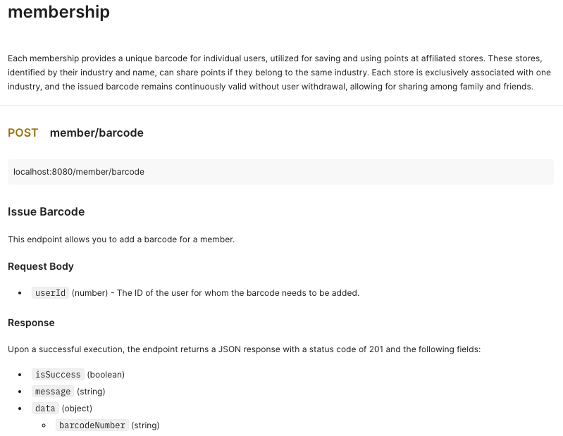
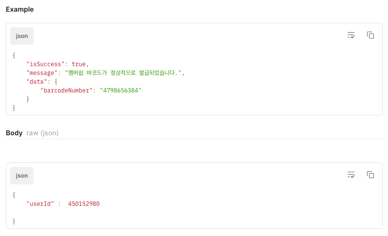
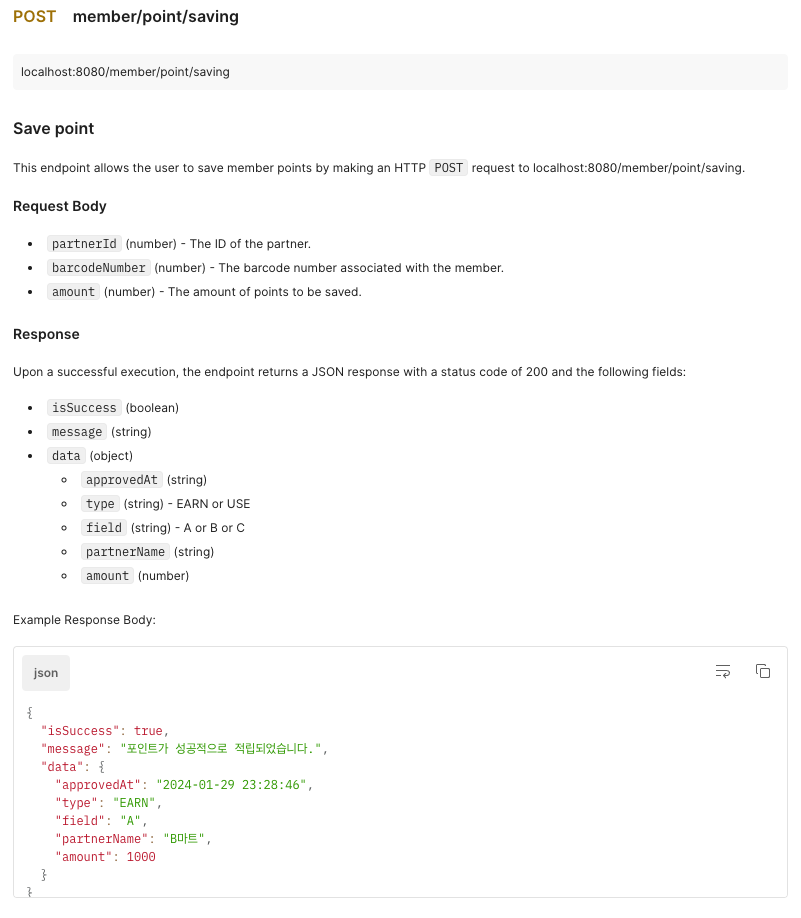
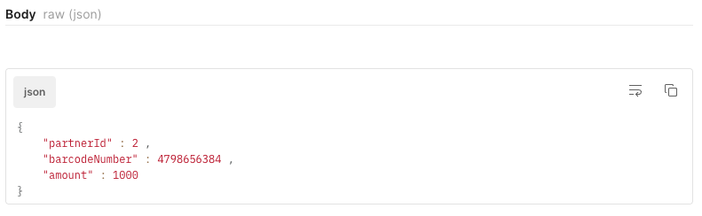
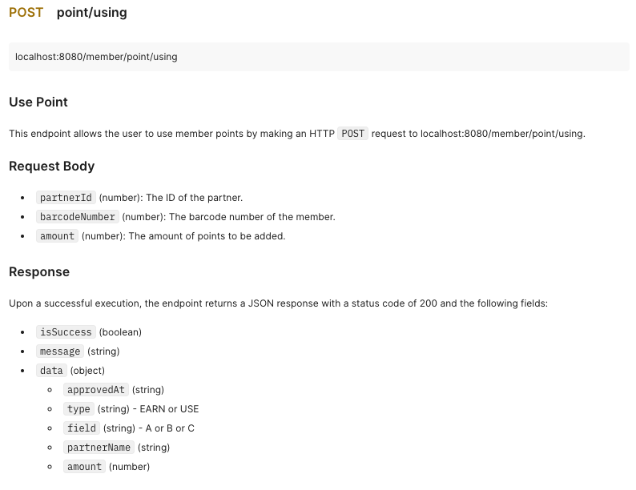
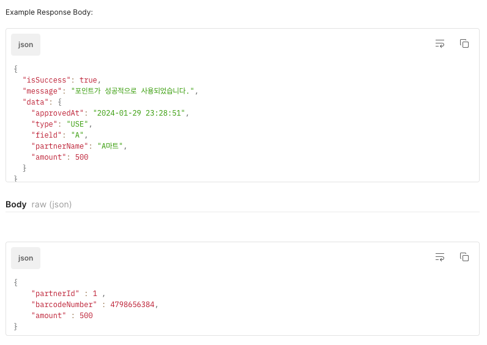
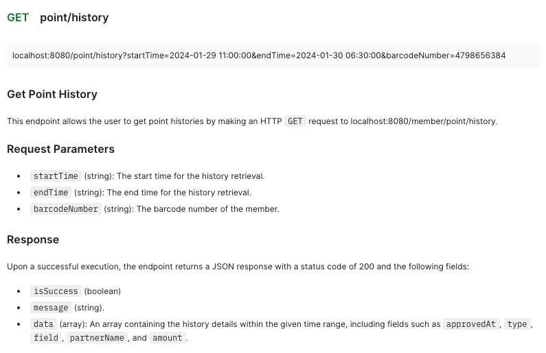
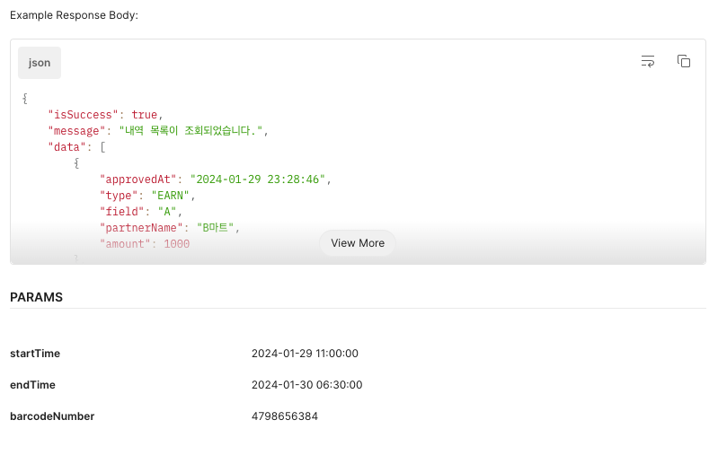

## #1. Development Design Comment 💡
> **ERD Diagram**과 **API 명세서**을 설계하면서 코멘트받은 내용을 바탕으로 정리하였습니다.

### 초기 ERD Diagram ✔️


| 코멘트 내용                                                      | 답변 내용                                              |
|-------------------------------------------------------------|----------------------------------------------------|
| 0x00. 설계한 포인트 테이블은 로그성 테이블인가? 업데이트되는 테이블인가?                 | [0x00 : Comment Resolved](#0x00--comment-resolved) |
| 0x01. 유저와 바코드 테이블 사이에 양방향 매핑이 필요할까?                         | [0x01 : Comment Resolved](#0x01--comment-resolved) |
| 0x02. 바코드 테이블의 PK는 Bigint로 변경하자                             | [0x02 : Comment Resolved](#0x02--comment-resolved) |
| 0x03. 지금 설계한 대로라면, 내역을 일일히 다 계산해서 현재 포인트를 계산해야하는데, 문제가 없을까? | [0x03 : Comment Resolved](#0x03--comment-resolved) |

### #0x00 : Comment Resolved

- 업데이트되는 테이블일 경우, 3개의 업종에 따라서 approved_at 칼럼이 매 사용/적립마다 **가장 최신 시점**으로 업데이트
  
    → **문제점 발생**
```
  1. 업데이트된 사용시기만 저장하면, 이전 사용시기 정보를 잃어버림
  2. 사용시기를 업데이트하면, type도 업데이트하고, amount도 업데이트? → 매번 업데이트시 성능 문제
  3. 사용자나 친구, 가족이 동시에 바코드를 사용하는 상황이 있다면?
     - `발급된 멤버쉽 바코드는 가족이나 친구끼리 공유가 가능하다` 라는 요구사항 존재
     - 다른 값으로 업데이트 될 우려가 있음 MySQL Isolation level (팬텀 리드)
```

- `로그성 테이블` 일 경우, 해당 point 테이블이 매 사용/적립마다 새롭게 **쌓임**

  - 내가 설계한 의도는 로그성 테이블

### #0x01 : Comment Resolved

- 양방향 매핑일 필요가 없다고 판단
- **ERD 상에서는 양방향 매핑이 존재해서는 안된다!**

### #0x02 : Comment Resolved
- 이유가 무엇일까? 

    → MySQL 인덱스 원리 (정렬) : Barcode 값이 들어올 때마다 MySQL에서 정렬을 해야함

### #0x03 : Comment Resolved
* 문제가 있다! 유저의 최종 포인트 (현재 포인트)를 계산하기 위해서 두가지의 방법이 제시될 수 있다.
```
2. user에 포인트 컬럼 추가
2. user에 따로 포인트 테이블
```
→ **업종별로 포인트를 관리**하도록 해야하므로 나는 포인트 테이블을 따로 만들고, 포인트 테이블에 업종별 최종 포인트 저장하도록 구성했다.


### 최종 ERD Diagram ✔️


<br>


| 코멘트 내용                                                     | 답변 내용                                              |
|------------------------------------------------------------|----------------------------------------------------|
| 0x04. isSuccess 필드가 있는 경우가 있고, 없는 경우가 있는데, 맞춰줄 필요가 있지 않을까? | [0x04 : Comment Resolved](#0x04--comment-resolved) |


### #0x04 : Comment Resolved

`isSuccess 왜 필요한가?`

- 성공했을 경우, HTTP Code만으로는 성공했을 때 어떤 정보들이 생성되었는지 등을 알 수 없음
- 실패했을 경우, HTTP Code외에 추가 오류 정보를 제공하면 클라이언트 단에서 오류를 더 적절하게 취할 수 있음
- 성공 시 응답, 실패 시 응답을 다르게 표현해보자

`RFC 7807 Error Code`
- Error에 대한 표준 존재

`Error Code가 필요한 이유`    
- 클라이언트 단에서는 **어떤 예외인지에 따라서 다르게 처리하는 로직 필요**             
→ **다른 예외들이 동일한 StatusCode를 제공하는 경우**가 많으므로 클라이언트 단이 StatusCode와 더불어 **추가로 Error Message를 참조해서 처리**해야 하는 상황이 생긴 것!          

- 예시           
```
{           
    "type": "/errors/incorrect-user-pass",           
    "title": "Incorrect username or password.",            
    "status": 401,
    "detail": "Authentication failed due to incorrect username or password.",       
    "instance": "/login/log/abc123"        
}      
```         
- **type:** 오류를 분류하는 URI 식별자      
- **title:** 오류에 대한 간략하고 사람이 읽을 수 있는 메시지       
- **status:** HTTP 응답 코드 (Optional)      
- **detail:** 사람이 읽을 수 있는 오류 설명       
- **instance:** 오류의 특정 발생을 식별하는 URI        


- 현업에서는 회사마다 다르게 사용 but, 학생일 때 해보는 것이 좋다.
- [Spring - REST API에서 직접 정의한 Error code를 사용하는 이유!](https://jaehoney.tistory.com/240)
- 나같은 경우, Error Code를 다음과 같이 작성했다.
  - `@Valid` Error가 났을 경우의 예시이다.
```
{
    "code": "INVALID_PARAMETER",
    "message": "Invalid parameter included",
    "errors": [
        {
            "field": "partnerId",
            "message": "널이어서는 안됩니다"
        }
    ]
}
```


## #2. 최종 API 명세서 ✏️
 
















---
## #3. Code Comment 📜

> **코드**를 작성하면서 코멘트 받은 내용을 바탕으로 정리하였습니다.


| 코멘트 내용                                                                                         | 답변 내용                                       |
|------------------------------------------------------------------------------------------------|---------------------------------------------|
| 0x05. Member와 MemberPoint가 Cascade로 처리되어야 한다고 생각하는 이유                                          | [0x05 : Comment Need](comments/0x05.md)     |
| 0x06. Assert가 어느 시점에 사용되는지, 사용한 이유                                                             | [0x06 : Comment Need](comments/0x06.md)     |
| 0x07. 테이블명/컬럼명 컨벤션                                                                             | [0x07 : Comment Resolved](comments/0x07.md) |
| 0x08. 서비스에서 사용자에게 응답될 Http Response 객체를 직접 만드는게 맞을까?                                           | [0x08 : Comment Resolved](comments/0x08.md) |
| 0x09. Service와 ServiceImpl가 같은 패키지에 있으면?                                                       | [0x09 : Comment Need](comments/0x09.md)     |
| 0x10. PartnerStoreCategory에서 컬럼 field 타입을 char보다 enum을 쓰자                                      | [0x10 : Comment Resolved](comments/0x10.md) |
| 0x11. @RequiredArgsConstructor, @NoArgsConstructor등 습관적으로 어노테이션을 쓰지말고, 왜 필요한지 생각해보자            | [0x11 : Comment Resolved](comments/0x11.md) | 
| 0x12. LocalDateTime말고 Instant, OffsetDateTime, ZonedDateTime을 사용해보자                            | [0x12 : Comment Need](comments/0x12.md)     |                                                                               
| 0x13. 메소드 명이나 변수명에 ~List같이 자료형을 포함시키지 말자                                                       | [0x13 : Comment Resolved](comments/0x13.md) |
| 0x14. 작성한 코드에서 PartnerStore와 PointHistory의 관계를 봤을 때, 상호명이 변경될 경우 PointHistory도 영향을 받을 수 있지않을까? | [0x14 : Comment Need](comments/0x14.md)     |                                                                       
| 0x15. 메소드 파라미터와 반환 값으로 Primitive Type이 아니라 Wrapper Type을 사용한 이유                                | [0x15 : Comment Resolved](comments/0x15.md) |                                                                            
| 0x16. 양방향 관계에서 엔티티 저장 방법에 대한 질문 : 연관관계 편의메소드                                                   | [0x16 : Comment Need](comments/0x16.md)     |
| 0x17. 서비스가 너무 뚱뚱해! Facade Pattern을 이용해보자                                                       | [0x17 : Comment Need](comments/0x17.md)     |
| 0x18. partnerCategory를 찾을때 partnerfindById(1L)를 이용했는데 데이터베이스에 저장된 id값이 1번 아니라면?                | [0x18 : Comment Need](comments/0x18.md)     |
| 0x19. return pointHistoryRespostiory.save(pointHistory) 방식을 사용하자                               | [0x19 : Comment Need](comments/0x19.md)     |
| 0x20. build.gradle.kts로 변경해보자                                                                  | [0x20 : Comment Need](comments/0x20.md)     |


---

## #4. Learning ✨


> 간단한 과제이지만, 굉장히 배운 내용이 많습니다. 이에 관해 정리한 내용입니다. 

[Git Branch Commit and.. Commit은 언제 해야할까?](https://velog.io/@kirise/GithubTIL-Git-Branch-Commit-and..-Commit%EC%9D%80-%EC%96%B8%EC%A0%9C-%ED%95%B4%EC%95%BC%ED%95%A0%EA%B9%8C)

[JPA Dirty Checking](https://velog.io/@kirise/SpringTIL-JPA-Dirty-Checking)

[@Transactional를 쓰는 이유](https://velog.io/@kirise/Transactional%EB%A5%BC-%EC%93%B0%EB%8A%94-%EC%9D%B4%EC%9C%A0)

[JPA Entity Class에서 @NoArgsConstructor(access = AccessLevel.PROTECTED) 왜 사용할까?](https://velog.io/@kirise/JPA-Entity-Class%EC%97%90%EC%84%9C-NoArgsConstructoraccess-AccessLevel.PROTECTED-%EC%99%9C-%EC%82%AC%EC%9A%A9%ED%95%A0%EA%B9%8C-7xqp8zz8)


---

## #5. Questions ❓

> 코드랑 comments 폴더에 있는 read.me들 확인해주세요! 최고 :)

